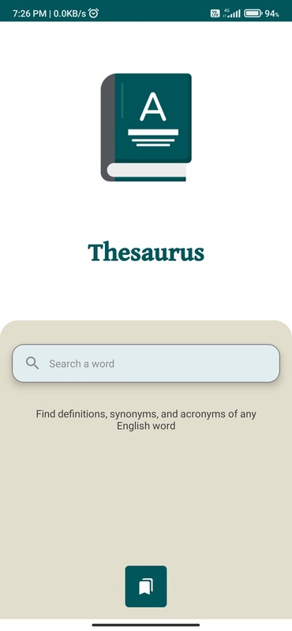
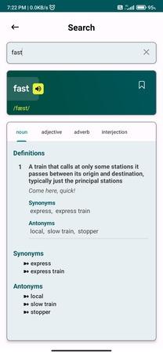
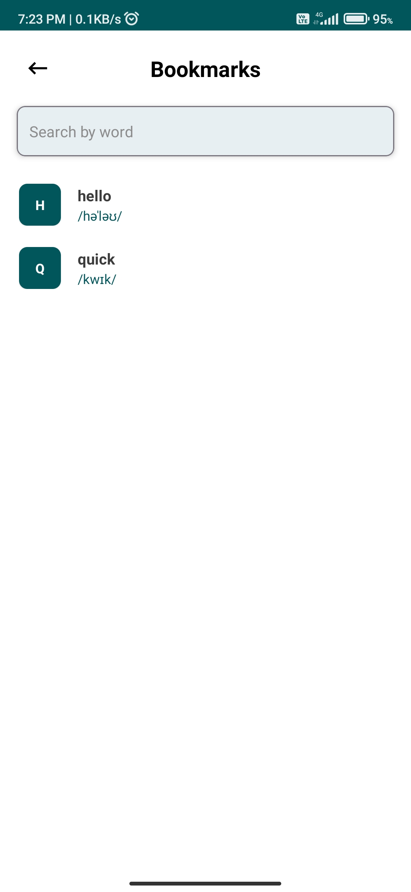

Thesaurus App [In progress 🚧]
=============

**Thesaurus App** is an Android application created to find the definitions, synonyms and antonyms of English words. The data is fetched from an open-source dictionary API. You can access the API from [here](https://dictionaryapi.dev/).

The app is currently in early stage development and is not yet available on the Play Store.

# Features
Users can search for the definitions, synonyms and antonyms of any English word with the **Thesaurus App**. Words can also be bookmarked, which can be accessed later offline.

## Screenshots

<!--- 
 --->
<!--- Comments are Fun --->
 

# Development Environment

**Thesaurus App** uses the Gradle build system and can be imported directly into the latest stable
version of Android Studio. The `debug`
build can be built and run using the default configuration.

# Architecture

The **Thesaurus App** follows the MVVM pattern throughout its development.
